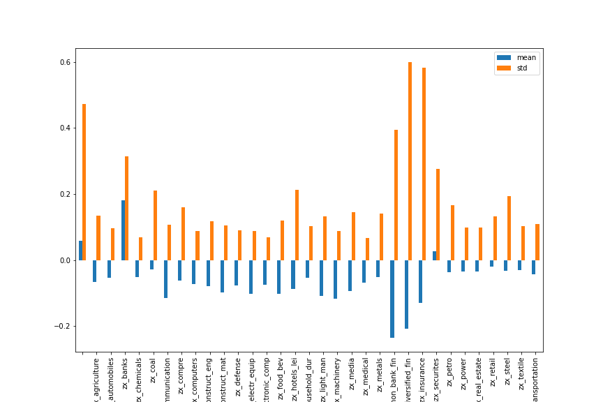

# 财务数据构建的财务风险预警指标

## 摘要

复式记账法下的记账科目之间有一定的勾稽关系。上市公司的记账方式采用的是复式记账法，因此一笔交易都会涉及到两个记账科目。而不同的记账科目之间有一定的勾稽关系，例如企业有一笔收入，则对应的会在现金或应收帐款等科目中对应的记上一笔。这样，就会在记账科目之间产生一定的勾稽关系。如果一家公司的营业收入特别高，但是相应的没有应收帐款或是现金等科目的对应增加，则是明显不合理的情况，因此可以利用科目之间的勾稽关系，构建出一系列具有相关关系的财务指标比例，以此来监测上市公司的财务状况。

同行业公司之间财务指标的比例在大数定理的约束下服从正态分布。由于同行业的公司之间经营业务具有相似性，业务模式也具有一定的相似性，因此同行业下公司应当在各项具有勾稽关系的指标之间具有一定的相似性。我们可以假设同行业下的公司具有勾稽关系的财务科目之间都来自于独立同分布的总体，在大数定理的约束下，这些样本可以近似的构建出一个正态分布。

出现财务质量风险的公司会出现财务指标在异常的状况。财务质量风险的发生往往伴随着下一期净利润的大幅下降、财务造假等现象。上市公司针对自身财务风险，会通过利用售后回租，关联交易等各种各样的手段美化装饰自身的财务报表，维持自身股价。但是通过这些手段都会在财务报表中留下蛛丝马迹。本报告的目的就是利用同行业间的横向对比，将上市公司财务报表中可能存在的问题挖掘出来，为投资者提供财务风险预警的参考。

## 一、	财务信息造假的“高风险”科目

上市公司采用的记账方式为复式记账法，在这种记账方法的约束下，企业的每一笔交易都会涉及两个科目，分别被标记为借方和贷方。在这种情况下，企业的每一笔交易涉及的资产、负债和权益都会被完整的记录下来，保证了所有交易资金的来源和去向记录的完整性。在这种记账方式下，记账的科目之间会有特定的勾稽关系，在记账操作上这些科目可能存在此消彼长或是同涨同跌的关系。一些公司企图通过某些手段掩饰当前季度净利润的匮乏，可能会通过销售变卖资产来换取利润，这种掩饰方式可能会导致财务指标的偏离。

### 应收帐款

在工业企业中，应收帐款是十分常见的科目，但同时也是企业希望掩盖净利润业绩降低最常用的记账科目。为了太高利润，上市公司会与关联企业发生交易，这些交易往往是非现金交易，通过赊账的方式进行，例如企业向关联企业赊销部分产品，提高当季度的净利润。但是在进行此项操作的同时也大幅增加了企业的应收帐款，导致应收帐款与净利润比值会明显偏离正常的比例。

### 坏账准备

在会计准则中，与应收账款同时出现的是“坏账准备金”，坏账准备即是企业在正常的赊销环节中，由于未来可能有一部分的应收帐款无法回收导致的可能损失。一般企业在进行会计处理时会按照固定的坏账准备计提准备金，但如果企业利润当季度并不理想，同时又有大量的应收帐款没有收回，此时就可以很轻易的通过微小的坏账准备金计提比例的调整来达到粉饰利润的目的。

### 在建工程

在建工程是指企业固定资产的新建、改建、扩建，或技术改造、设备更新和大修理工程等尚未完工的工程支出。由于在建工程的规模、难度等各不相同，使企业拥有了大幅度“周旋”的余地，企业可以利用在某一个时期内正在建设的在建工程将费用资本化，减少成本，从而提高利润。很多公司可能在很长时间内都没有结束在建工程的建设工作，甚至有些公司的在建工程只在“纸上”存在，都是在利用在建工程这一科目对财务报表进行包装修饰。

## 二、财务信息质量风险预警指标

同行业之间的公司具有经营范围相同，经营内容相似的特点，因此其公布的财务信息具有横向的可比性，通常进行财务对比分析也采用的是对同行业的财务数据进行比对分析，找到行业内业绩优秀的公司，同样通过横向的对比也能够找到财务信息可能存在的风险。

在同业内比较过程中，由于经营内容或业务模式的相似或一致，某些具有一定勾稽关系的财务指标，其相对比例在同行业内应当保持接近或一致。在此假设下，由于大数定理对于独立同分布总体中的重复采样结果会服从正态分布的约束，我们可以通过同行业内的公司历史数据构建出一套指标体系，在指标体系上构建多个正态分布，每个正态分布都是以行业内财务报表科目的平均为均值，以行业内财务报表科目的波动为标准差。在这样的正态分布下，每个行业内的公司都会相对行业的正态分布产生一个分位点。这个分位点的数值可以代表公司的财务指标相对于行业均值的偏离程度。而偏离程度越大的公司，越有可能产生财务造假的风险。

## 三、指标的计算与检验

指标的计算采用的是中信一级行业分类，为了保证充足的样本量，我们采用每个报告期前的共30个报告期的财务数据对行业内的正态分布进行构建。对于原始的财务数据，为了避免缺失值以及极端值的影响，我们进行了以下处理：

1. 极端值处理：采用中位数去极值的方法，首先计算数据的中位数，再计算这组数据到中位数的距离得出这组距离的中位数，再将数据中超出中位数正负五倍距离的中位数的数据拉回到正负五倍中位数的位置，以此作为极端值去除的处理办法。
2. 缺失值处理：由于上市公司会计准则在过去的十年间发生了一定程度对变化，很多科目的数据无法准确的获取，为了保证数据的准确性，我们对部分缺失值过于严重的科目进行了剔除的处理。对于其他部分缺失的数据，我们采用行业均值进行填充以减少缺失值对数据的影响。
3. 标准化处理：标准化处理采用的方法是zscore标准化，即将数据减去均值除以标准差得到的结果。

### 描述性统计分析

经过极端值处理、缺失值处理以及标准化处理后的数据按照假设应当近似的服从正态分布，我们可以对指标体系中的每个指标按照一年的时间窗口进行切分得到每个时间窗中样本指标的分布情况，以下展示的是部分指标的分布的偏度和峰度。

@import "kurt.csv"

@import "skew.csv"

可见，尽管分布在不同程度上数据具有一些尖峰厚尾和左右偏态的特征，但都能够近似的服从正态分布。

### 指标计算与有效性的检验

接下来，为了避免数据量过少而引发的误差，我们设置三十个报告期为时间窗口，对每个报告期进行滚动的计算，即通过当前计算的报告期前的共计30个报告期，按照行业对个股事先进行分类，在对每个类别中计算行业内指标体系中各个指标的均值和标准差，利用行业均值与标准差计算行业内个股的财务指标的z-分数，得到近似服从标准正态分布的一组数据。最后依据正态分布的分位点数确定每个个股在财务信息质量上的预警评分。最后通过计算各个财务指标的预警评分均值得出个股的财务信息质量预警得分。

根据指标的定义，该评分越高意味着公司财务信息质量可能出现问题的概率就越高，通过企业在下一个报告期净利润TTM的增幅，我们使用个股的预警得分与下一个报告期的净利润TTM增幅之间的相关系数IC值进行计算，挖掘二者之间的相关性。其中IC计算的结果如下所示

为了检验该结果的显著性，通过计算该相关系数序列的T检验值与对应的p值，得到t值结果为-14.21，p值为8*10^-17，结果显示二者相关系数是显著为负的，时间序列上的均值为-0.07，标准差为0.03，表明这一指标具有稳定的对可能出现财务信息质量问题公司的预测作用。

为了保证计算结果的全面与客观性，我们还将预警得分按照行业进行划分，计算每个行业下个股预警得分与未来一个报告期内的净利润TTM增幅之间相关系数IC的均值与标准差，结果如下图所示：

可见，在行业分类的视角下，除了由于数据缺失或无法获取信息导致的没有分组的行业、银行和证券保险这三个行业分类的相关系数均值为正数以外，其他的行业分类的相关系数均值都为负值，同时标准差维持在较小的水平。可见在按照行业划分的视角下是可以推断出财务信息质量预警分对下一个报告期的公司净利润TTM具有一定的预测作用的。

对于未分类、银行与证券保险这三个分类下相关系数为正，是因为银行、证券以及未分类的三种分类下每个报告期截面中股票的数据量太小。导致模型本身不是稳健的，从时间序列上的标准差这一数据也可以看出这一结果，所以导致这三条相关系数均值得出正数的结果。

接下来，针对不同的板块，我们将每个板块下的财务信息预警得分与下一报告期的净利润TTM增幅之间的相关系数IC值进行计算，结果如下图所示：

科创板由于成立时间较短，数据量很少，所以得出的结果可能并不准确。计算各个板块的相关系数均值和方差，类似行业分类视角下的处理，我们可以得到如下所示的统计图：

可见除了unknown板块（即未知板块相关信息的股票）与成立时间较短的科创板股票的预警分数相关系数由于数据量较少而为正数，同时伴随着极大的标准差之外，其他三大板块的数据结果都体现出了一定程度的负相关性。可见在创业板下的负相关性最强，同时主板的负相关性最弱。可能的原因是上市板块不同，上市需要达到的要求不同，不同规模的公司出现财务风险的概率不尽相同相关，因此可见，在市值中小、上市要求相对较为宽松的创业板，中小板上，使用该指标的效果更好。

计算负面清单，使用净利润增速、ROE指标作为衡量，是否有雷股，是否组合会有明显收益跑输大盘。查看各个板块、行业的财务时序稳定性，构建行业指标等。